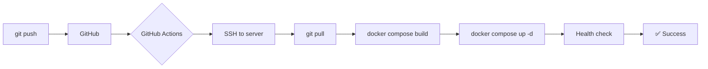

# 🚀 Автодеплой на свой сервер

Настройка автоматического деплоя n8n на ваш собственный VPS/сервер при push в GitHub.

---

## 🎯 Варианты автодеплоя

| Метод | Сложность | Рекомендация |
|-------|-----------|--------------|
| **GitHub Actions + SSH** | 🟢 Средняя | ⭐⭐⭐⭐⭐ Лучший вариант |
| **Webhook на сервере** | 🟡 Средняя | ⭐⭐⭐⭐ Гибкий |
| **Watchtower (Docker)** | 🟢 Легко | ⭐⭐⭐ Только для Docker |
| **Jenkins/GitLab CI** | 🔴 Сложная | ⭐⭐⭐ Для больших команд |

---

## 1️⃣ GitHub Actions + SSH (РЕКОМЕНДУЮ)

Самый популярный и простой способ.

### Как это работает:

```
GitHub push → GitHub Actions → SSH на сервер → git pull → docker compose restart
```

### Настройка:

#### Шаг 1: На сервере создайте SSH ключ для деплоя

```bash
# На вашем сервере
ssh-keygen -t ed25519 -C "github-deploy" -f ~/.ssh/github_deploy
cat ~/.ssh/github_deploy.pub >> ~/.ssh/authorized_keys
cat ~/.ssh/github_deploy  # Скопируйте приватный ключ
```

#### Шаг 2: Добавьте секреты в GitHub

1. Откройте репозиторий: https://github.com/nybble777/n8n-ai
2. Settings → Secrets and variables → Actions → New repository secret

Добавьте:
- `SSH_PRIVATE_KEY` → приватный ключ из шага 1
- `SSH_HOST` → IP вашего сервера (например: `123.45.67.89`)
- `SSH_USER` → пользователь на сервере (например: `root` или `ubuntu`)
- `SSH_PORT` → SSH порт (обычно `22`)

#### Шаг 3: Создайте workflow

Создайте файл `.github/workflows/deploy.yml`:

```yaml
name: Deploy to VPS

on:
  push:
    branches:
      - main

jobs:
  deploy:
    runs-on: ubuntu-latest
    
    steps:
    - name: Deploy to server
      uses: appleboy/ssh-action@master
      with:
        host: ${{ secrets.SSH_HOST }}
        username: ${{ secrets.SSH_USER }}
        key: ${{ secrets.SSH_PRIVATE_KEY }}
        port: ${{ secrets.SSH_PORT }}
        script: |
          cd /opt/n8n
          git pull origin main
          docker compose down
          docker compose up -d --build
          docker compose logs -f --tail=50
```

#### Шаг 4: На сервере подготовьте директорию

```bash
# На вашем сервере
sudo mkdir -p /opt/n8n
cd /opt/n8n

# Клонируйте репозиторий
git clone https://github.com/nybble777/n8n-ai.git .

# Создайте .env файл
cat > .env << 'EOF'
N8N_PORT=5678
N8N_PROTOCOL=https
N8N_HOST=ваш-домен.com
N8N_BASIC_AUTH_ACTIVE=true
N8N_BASIC_AUTH_USER=admin
N8N_BASIC_AUTH_PASSWORD=ваш_пароль
N8N_ENCRYPTION_KEY=ваш_ключ
DB_TYPE=postgresdb
POSTGRES_USER=n8n
POSTGRES_PASSWORD=ваш_пароль_бд
POSTGRES_DB=n8n
EOF

# Запустите
docker compose -f docker-compose.production.yml up -d
```

#### Шаг 5: Готово!

Теперь при каждом `git push origin main`:
1. GitHub Actions запустится автоматически
2. Подключится к вашему серверу по SSH
3. Выполнит `git pull`
4. Перезапустит Docker контейнеры
5. n8n обновится!

---

## 2️⃣ Webhook на сервере

Ваш сервер слушает webhook от GitHub и деплоит при получении.

### Настройка:

#### Шаг 1: Установите webhook listener на сервере

```bash
# На вашем сервере
npm install -g webhook

# Создайте конфиг
mkdir -p /opt/webhook
cat > /opt/webhook/hooks.json << 'EOF'
[
  {
    "id": "deploy-n8n",
    "execute-command": "/opt/webhook/deploy.sh",
    "command-working-directory": "/opt/n8n",
    "pass-arguments-to-command": [
      {
        "source": "payload",
        "name": "ref"
      }
    ],
    "trigger-rule": {
      "match": {
        "type": "payload-hash-sha1",
        "secret": "ВАШ_СЕКРЕТНЫЙ_КЛЮЧ",
        "parameter": {
          "source": "header",
          "name": "X-Hub-Signature"
        }
      }
    }
  }
]
EOF
```

#### Шаг 2: Создайте deploy скрипт

```bash
cat > /opt/webhook/deploy.sh << 'EOF'
#!/bin/bash

set -e

echo "Starting deployment..."

cd /opt/n8n

# Pull изменения
git pull origin main

# Пересоздание контейнеров
docker compose -f docker-compose.production.yml down
docker compose -f docker-compose.production.yml up -d --build

echo "Deployment completed!"
EOF

chmod +x /opt/webhook/deploy.sh
```

#### Шаг 3: Запустите webhook listener

```bash
# Создайте systemd service
sudo cat > /etc/systemd/system/webhook.service << 'EOF'
[Unit]
Description=Webhook Listener
After=network.target

[Service]
Type=simple
User=root
ExecStart=/usr/bin/webhook -hooks /opt/webhook/hooks.json -verbose
Restart=always

[Install]
WantedBy=multi-user.target
EOF

sudo systemctl daemon-reload
sudo systemctl enable webhook
sudo systemctl start webhook
```

#### Шаг 4: Настройте webhook в GitHub

1. Откройте репозиторий: https://github.com/nybble777/n8n-ai
2. Settings → Webhooks → Add webhook
3. Настройки:
   - Payload URL: `http://ваш-сервер:9000/hooks/deploy-n8n`
   - Content type: `application/json`
   - Secret: `ВАШ_СЕКРЕТНЫЙ_КЛЮЧ` (тот же что в hooks.json)
   - Events: Just the push event
4. Add webhook

#### Шаг 5: Готово!

Теперь при push в main GitHub отправит webhook на ваш сервер, который автоматически задеплоит изменения.

---

## 3️⃣ Watchtower (автообновление Docker образов)

Простой вариант если используете готовые Docker образы.

### Настройка:

```yaml
# docker-compose.yml
services:
  n8n:
    image: n8nio/n8n:latest
    # ... остальные настройки

  watchtower:
    image: containrrr/watchtower
    volumes:
      - /var/run/docker.sock:/var/run/docker.sock
    environment:
      - WATCHTOWER_POLL_INTERVAL=300  # Проверка каждые 5 минут
      - WATCHTOWER_CLEANUP=true
    restart: always
```

Watchtower автоматически проверяет обновления образов и перезапускает контейнеры.

**Минус:** Работает только с готовыми образами, не с вашим кодом.

---

## 4️⃣ Продвинутые варианты

### A) GitLab CI/CD

Если используете GitLab вместо GitHub:

```yaml
# .gitlab-ci.yml
stages:
  - deploy

deploy_production:
  stage: deploy
  only:
    - main
  script:
    - apt-get update -qq && apt-get install -y -qq openssh-client
    - eval $(ssh-agent -s)
    - echo "$SSH_PRIVATE_KEY" | tr -d '\r' | ssh-add -
    - mkdir -p ~/.ssh
    - chmod 700 ~/.ssh
    - ssh-keyscan $SSH_HOST >> ~/.ssh/known_hosts
    - chmod 644 ~/.ssh/known_hosts
    - ssh $SSH_USER@$SSH_HOST "cd /opt/n8n && git pull && docker compose up -d --build"
```

### B) Portainer (GUI для Docker)

1. Установите Portainer на сервере
2. Подключите GitHub webhook
3. Деплой через веб-интерфейс

### C) Ansible

Для множества серверов:

```yaml
# playbook.yml
---
- hosts: n8n_servers
  tasks:
    - name: Pull latest code
      git:
        repo: https://github.com/nybble777/n8n-ai.git
        dest: /opt/n8n
        version: main
    
    - name: Restart containers
      docker_compose:
        project_src: /opt/n8n
        build: yes
        state: present
```

---

## 📋 Сравнение методов

### GitHub Actions + SSH ⭐⭐⭐⭐⭐

**Плюсы:**
- ✅ Полный контроль
- ✅ Логи деплоя в GitHub
- ✅ Условное выполнение (только main, tags, etc)
- ✅ Можно добавить тесты перед деплоем
- ✅ Бесплатно (2000 минут/месяц)

**Минусы:**
- ⚠️ Требует SSH доступ
- ⚠️ Нужно настраивать ключи

**Когда использовать:** 
- Профессиональный проект
- Нужны логи деплоя
- Несколько окружений (dev, staging, prod)

---

### Webhook на сервере ⭐⭐⭐⭐

**Плюсы:**
- ✅ Быстрый отклик
- ✅ Работает на вашем сервере
- ✅ Гибкая настройка
- ✅ Не зависит от внешних сервисов

**Минусы:**
- ⚠️ Нужно держать webhook listener
- ⚠️ Дополнительный порт (9000)
- ⚠️ Нет логов в GitHub

**Когда использовать:**
- Хотите полный контроль
- Уже используете webhook для других задач
- Не хотите зависеть от GitHub Actions

---

### Watchtower ⭐⭐⭐

**Плюсы:**
- ✅ Очень просто
- ✅ Автоматические обновления
- ✅ Не требует настройки CI/CD

**Минусы:**
- ❌ Только для Docker образов
- ❌ Не для custom code
- ⚠️ Может обновиться в неудобное время

**Когда использовать:**
- Используете только официальные образы
- Хотите всегда быть на latest версии
- Простой проект

---

## 🔒 Безопасность

### Для GitHub Actions:

1. **Используйте секреты** для всех чувствительных данных
2. **Ограничьте SSH ключ** только нужными командами:
   ```bash
   # В ~/.ssh/authorized_keys добавьте перед ключом:
   command="cd /opt/n8n && git pull && docker compose up -d" ssh-ed25519 AAAA...
   ```
3. **Создайте отдельного пользователя** для деплоя
4. **Используйте fail2ban** для защиты SSH

### Для Webhook:

1. **Всегда используйте секрет** для проверки подписи
2. **Ограничьте IP** если возможно (GitHub IPs)
3. **Используйте HTTPS** с Let's Encrypt
4. **Логируйте все запросы**

---

## 🎯 Рекомендованная настройка

Для большинства случаев рекомендую **GitHub Actions + SSH**:

```yaml
# .github/workflows/deploy.yml
name: Deploy n8n to VPS

on:
  push:
    branches:
      - main
    paths-ignore:
      - 'README.md'
      - 'docs/**'

jobs:
  deploy:
    runs-on: ubuntu-latest
    
    steps:
    - name: 🚀 Deploy to production server
      uses: appleboy/ssh-action@master
      with:
        host: ${{ secrets.SSH_HOST }}
        username: ${{ secrets.SSH_USER }}
        key: ${{ secrets.SSH_PRIVATE_KEY }}
        port: ${{ secrets.SSH_PORT }}
        script: |
          set -e
          
          echo "📦 Pulling latest changes..."
          cd /opt/n8n
          git pull origin main
          
          echo "🔨 Building and restarting containers..."
          docker compose -f docker-compose.production.yml down
          docker compose -f docker-compose.production.yml up -d --build
          
          echo "⏳ Waiting for n8n to be ready..."
          sleep 10
          
          echo "✅ Checking n8n health..."
          curl -f http://localhost:5678/healthz || exit 1
          
          echo "🎉 Deployment completed successfully!"
    
    - name: 📢 Notify on failure
      if: failure()
      run: echo "Deployment failed!"
```

---

## 📁 Структура на сервере

```
/opt/n8n/
├── .env                              # Environment variables
├── .git/                             # Git репозиторий
├── docker-compose.production.yml     # Production compose
├── Dockerfile.render                 # Custom Dockerfile
├── data/                             # n8n data (workflows, etc)
│   └── .n8n/
└── postgres-data/                    # PostgreSQL data
```

---

## 🔄 Workflow деплоя



---

## 💡 Дополнительные возможности

### 1. Blue-Green Deployment

```bash
# Запускаем новую версию на другом порту
docker compose -f docker-compose.new.yml up -d
# Проверяем
curl http://localhost:5679/healthz
# Переключаем nginx
# Останавливаем старую версию
```

### 2. Rollback

```bash
# В deploy.sh сохраняйте предыдущую версию
git tag -a "deploy-$(date +%Y%m%d-%H%M%S)" -m "Backup before deploy"
# При проблемах:
git checkout deploy-YYYYMMDD-HHMMSS
docker compose up -d --build
```

### 3. Уведомления

Добавьте уведомления в Telegram/Slack при деплое:

```yaml
- name: Send notification
  run: |
    curl -X POST https://api.telegram.org/bot${{ secrets.BOT_TOKEN }}/sendMessage \
      -d chat_id=${{ secrets.CHAT_ID }} \
      -d text="✅ n8n deployed successfully!"
```

---

## ❓ FAQ

**Q: Можно ли деплоить на несколько серверов сразу?**
A: Да! Используйте matrix в GitHub Actions:
```yaml
strategy:
  matrix:
    server: [server1, server2, server3]
```

**Q: Как сделать staging окружение?**
A: Создайте ветку `staging` и отдельный workflow для неё.

**Q: Нужен ли мне свой Docker Registry?**
A: Нет, если деплоите через git pull. Да, если хотите использовать собственные образы.

**Q: Как откатиться к предыдущей версии?**
A: `git checkout previous-commit && docker compose up -d --build`

---

## 🚀 Готовые скрипты

Создам для вас готовые конфиги в следующем файле!

Смотрите: `AUTODEPLOY_SCRIPTS.md`

